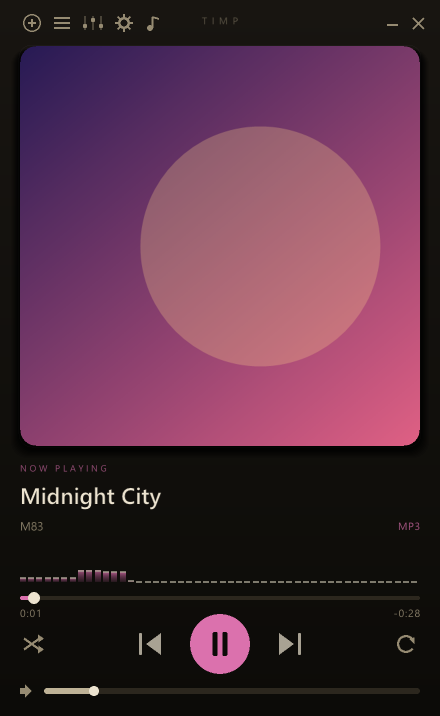
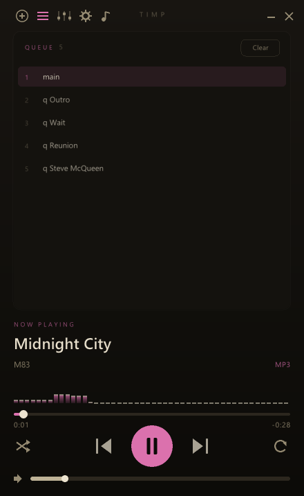
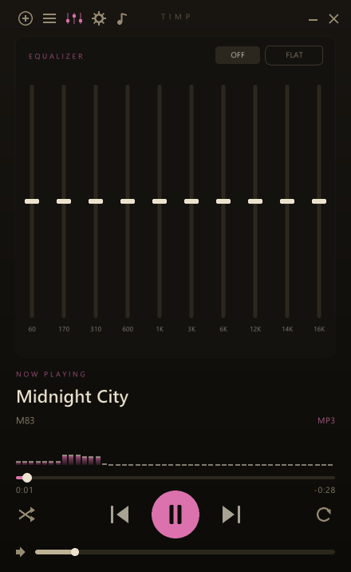
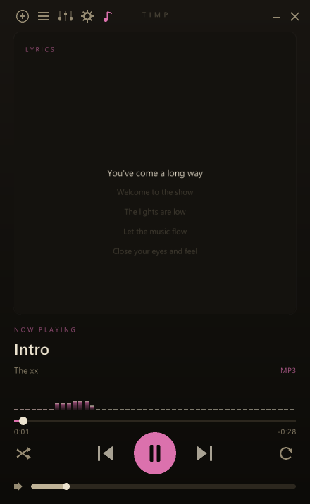
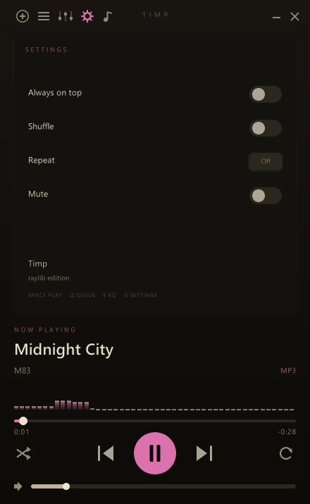

# Timp

A small, native, album-art-forward music player written in C with
[raylib](https://www.raylib.com/).

Borderless single window with a Hi-Fi look: large cover art, anti-aliased
typography, an accent color sampled from the artwork, a live spectrum, a
10-band EQ, a slide-out saveable playlist drawer, and synced lyrics. Audio is
decoded by [miniaudio](https://miniaud.io/) (MP3 / FLAC / OGG / WAV, Unicode paths).
No installer, no runtime, no telemetry — raylib is linked statically, so the
whole app is a single `timp.exe`.

<p align="center">
  
</p>

## Features

- **Formats** — MP3, FLAC, OGG/Vorbis, WAV (whatever miniaudio decodes)
- **Unicode paths** — file open and decoding go through the Win32 wide API, so
  non-ASCII folders and filenames work end to end
- **Album art** — embedded covers (ID3v2 `APIC`, FLAC `PICTURE`) → a sibling
  `cover.jpg` / `folder.jpg` → a generated gradient; the **accent color is
  sampled from the artwork**
- **Lyrics** — synced `.lrc` (karaoke-style highlight), plain `.txt`, embedded
  ID3 `USLT` / Vorbis `LYRICS`, and an online **lrclib.net** fallback fetched on
  a background thread
- **Visualizers** — click the album art to cycle cover → spectrum bars →
  waveform; a mini spectrum sits under the title
- **Playlist drawer** — the queue lives in a panel that **slides out the left or
  right side** (your choice in Settings), extending the window beside the player.
  Drag files or a folder in (appends), drag rows to reorder, double-click to play,
  hover for a remove `×`, or clear it
- **Saved playlists** — name and **save** the queue as a standard `.m3u8`
  (UTF-8, absolute paths — so it opens in other players and survives across
  drives), **reopen** it from an in-app library, and overwrite with a confirm;
  stored in `%APPDATA%\Timp\Playlists\`
- **10-band equalizer** — 60 / 170 / 310 / 600 Hz / 1 / 3 / 6 / 12 / 14 / 16 kHz,
  with `ON` / `FLAT`
- **Transport** — play/pause, prev/next, **drag-to-scrub** seeking, volume,
  **fixed-order shuffle** (the whole list is shuffled once; next/prev follow that
  order), and 3-state repeat (off / one / all)
- **Tags** — title / artist / album read from ID3v2 and Vorbis comments
  (UTF-8 / UTF-16, full Latin + Turkish glyph coverage)
- **System integration** — system-wide media keys, always-on-top, and a
  procedurally-drawn app/taskbar icon
- **Persistent settings** — volume, EQ, always-on-top, playlist side, and window
  position are saved to `%APPDATA%\Timp\config.ini`
- **Polished window** — borderless with anti-aliased, rounded corners (Win11
  DWM) and no console window
- **Tiny** — pure C11 + raylib + miniaudio, statically linked into one exe

## Screenshots

<table>
  <tr>
    <td align="center"><br/><em>Queue — reorder / remove / clear</em></td>
    <td align="center"><br/><em>10-band EQ</em></td>
  </tr>
  <tr>
    <td align="center"><br/><em>Synced lyrics</em></td>
    <td align="center"><br/><em>Settings</em></td>
  </tr>
</table>

## Building

### Dependencies

- A C11 compiler (MSYS2 MinGW-w64 `gcc`) and `pkg-config`
- **raylib** (`mingw-w64-x86_64-raylib`)
- `miniaudio.h` and `stb_image.h` — fetched automatically by `setup.ps1`

### Windows (MSYS2 / MinGW64)

```powershell
pacman -S mingw-w64-x86_64-gcc mingw-w64-x86_64-pkgconf mingw-w64-x86_64-raylib
.\build.ps1
.\build\timp.exe
```

`build.ps1` fetches the vendored headers on first run, compiles incrementally,
embeds the `.exe` icon, and links a standalone `timp.exe` (no DLLs to ship).

> Fonts are currently loaded from `C:\Windows\Fonts` (Segoe UI), so the build
> targets Windows. Bundling an open font would make it cross-platform.

The build tooling is three small scripts:

| Script | Does |
| --- | --- |
| `setup.ps1` | Fetches the vendored headers (`miniaudio.h`, `stb_image.h`) into `vendor/`. Run automatically by `build.ps1`. |
| `build.ps1` | Compiles `src/*.c` and links the standalone `build\timp.exe`. |
| `installer.ps1` | Packages `timp.exe` into a Windows `Setup.exe` via [Forge](../Forge) + `forge.toml` (installs to Program Files with shortcuts). Optional — needs the Forge toolchain. |

## Usage

- **Drop files or a folder** onto the window to enqueue them, or click **`+`**
  (top-left) for the native open dialog.
- **Click the album art** to cycle through the cover and the visualizers.
- Top bar: **`+`** open · **`≡`** playlist drawer · **sliders** EQ · **gear**
  settings · **`♪`** lyrics.
- **Playlist drawer** — **`≡`** or `Q` slides it out beside the player.
  Double-click a row to play, drag rows to reorder, hover for the `×`, **Save**
  to store the list as a named playlist, or **Open** to load a saved one.
- **Seek** by dragging the progress bar; **volume** via its slider, the mouse
  wheel, or `↑` / `↓`.

### Keyboard

| Key | Action |
| --- | --- |
| Space | Play / pause |
| ← / → | Seek −5s / +5s |
| ↑ / ↓ | Volume up / down |
| `O` | Open file dialog |
| `Q` / `E` / `G` / `Y` | Queue / EQ / Settings / Lyrics panel |
| `S` / `L` | Shuffle / cycle repeat |
| `T` | Always on top |
| Media keys | Play/Pause, Stop, Prev, Next (system-wide) |

## Lyrics

For the playing track, Timp looks for lyrics in this order:

1. a sibling **`.lrc`** file (synced — shows a karaoke-style highlight),
2. a sibling **`.txt`** file (plain, scrollable),
3. **embedded** lyrics (ID3v2 `USLT` / Vorbis `LYRICS`),
4. **lrclib.net** — an online lookup by artist / title / duration, fetched in
   the background (shows "Searching lyrics…" while it runs).

## Configuration

`config.ini` lives in `%APPDATA%\Timp\`. Persisted keys:

```ini
volume = 0.700
always_on_top = 0
eq_enabled = 0
eq0 = 0.00          # … eq9 — per-band gains
playlist_side = 0   # 0 = drawer on the right, 1 = on the left
win_x = ...
win_y = ...
```

Saved playlists are standard `.m3u8` files in `%APPDATA%\Timp\Playlists\`
(use **Settings → Open folder** to reveal it).

## Project layout

```
src/
  rl_main.c      window, event loop, UI, all panels (raylib)
  audio.c        miniaudio engine — thread-safe decode, Unicode paths
  art.c          embedded + folder cover-art extraction & decode
  tags.c         ID3v2 / Vorbis metadata + embedded lyrics
  lyrics.c       .lrc / .txt parsing + lrclib.net online fetch (WinHTTP)
  osdialog.c     native open dialog + DWM rounded corners
  rlconfig.c     persistent %APPDATA% settings
  mediakeys.c    system-wide media-key hotkeys
  eq.c / fft.c   10-band EQ + spectrum FFT
  playlist.c     queue / index + fixed-order shuffle
  playlistio.c   save / load / list .m3u8 playlists
  vendor_ma.c    miniaudio implementation unit
vendor/          miniaudio.h, stb_image.h (fetched)
assets/timp.ico  embedded Windows executable icon
examples/        screenshots used in this README
```

## Credits

- **Author** — Şamil Bülbül
- **raylib** — window, input, rendering (zlib license)
- **miniaudio** — audio decode + output (public domain / MIT-0)
- **stb_image** — cover-art decoding (public domain / MIT)
- **lrclib.net** — community lyrics database

All code written for this project is released into the public domain.
