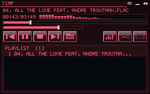
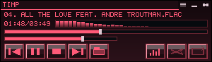
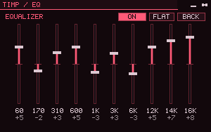
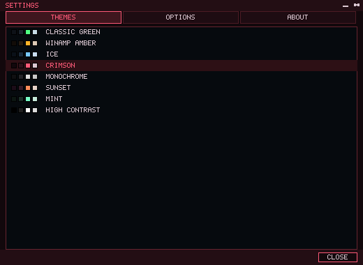
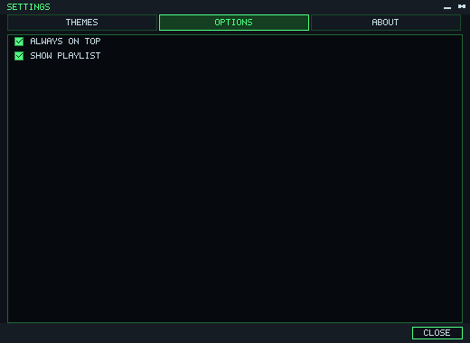
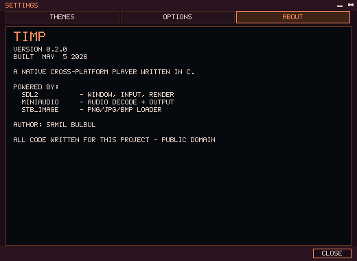

# Timp

A small, native, Winamp-style music player written in C.

Single-window, fixed pixel layout, beveled buttons, scrolling title text,
spectrum visualizer, 10-band EQ, and a built-in skin format. Cross-platform
on Windows, Linux, and macOS via SDL2 + miniaudio. No installer, no
runtime, no telemetry — the binary plus an `SDL2.dll` and a `skins/` folder
is the whole app.

<p align="center">
  
  <br/>
  <em>Main window — Crimson theme, playlist visible</em>
</p>

<p align="center">
  
  <br/>
  <em>Compact view with the playlist hidden</em>
</p>

## Features

- **Formats** — MP3, FLAC, WAV, OGG/Vorbis (whatever miniaudio + dr_flac decode)
- **Unicode paths** — file enumeration and audio decoding both go through the
  Win32 wide API, so non-ASCII folders and filenames work end to end
- **Playlist** — drag songs in to enqueue, drag rows to reorder, click the `×`
  to remove a row
- **File dialog** — built-in browser with arrow-key navigation
  (Up/Down/PageUp/PageDown/Home/End), drive picker (`..` from drive root lists
  logical drives on Windows), and a path strip you can click or `Ctrl+L` to
  type a path directly
- **10-band equalizer** — 60 / 170 / 310 / 600 Hz / 1 / 3 / 6 / 12 / 14 / 16 kHz,
  with `ON` / `FLAT` toggles and a spectrum view backed by an FFT
- **Themes** — eight presets (Classic Green, Winamp Amber, Ice, Crimson,
  Monochrome, Sunset, Mint, High Contrast), persisted across runs
- **Skins** — INI-described layout with optional PNG background; see
  [`skins/default/skin.ini`](skins/default/skin.ini) for the format
- **Media keys** — Play/Pause, Stop, Prev, Next work system-wide on Windows
  (Win32 `RegisterHotKey`) and via SDL keysyms elsewhere
- **Portable** — `config.ini` is written next to the executable, so you can
  drop the build folder onto a USB stick and it stays self-contained
- **Tiny** — pure C11, ~5k lines, no GUI toolkit, no scripting runtime

## Screenshots

<table>
  <tr>
    <td align="center"><br/><em>10-band EQ + spectrum</em></td>
    <td align="center"><br/><em>Settings → Themes</em></td>
  </tr>
  <tr>
    <td align="center"><br/><em>Settings → Options</em></td>
    <td align="center"><br/><em>Settings → About</em></td>
  </tr>
</table>

## Building

### Dependencies

- A C11 compiler (gcc, clang, MSVC via MinGW)
- SDL2 development headers
- `miniaudio.h` and `stb_image.h` — fetched automatically by the setup script

### Windows (MSYS2 / MinGW64)

```powershell
pacman -S mingw-w64-x86_64-gcc mingw-w64-x86_64-pkgconf mingw-w64-x86_64-SDL2
.\build.ps1
.\build\timp.exe
```

`build.ps1` runs `setup.ps1` on first build to fetch the vendored headers,
compiles incrementally, and copies `SDL2.dll` and `skins/` next to the
binary.

### Linux / macOS

```sh
# Debian/Ubuntu
sudo apt install build-essential pkg-config libsdl2-dev
# macOS (Homebrew)
brew install sdl2 pkg-config

./setup.sh
make
./build/timp
```

## Usage

- **Drop files** onto the window to enqueue them.
- **Click the folder button** to open the file dialog.
- **Double-click** a row in the playlist to play it; **drag** a row to
  reorder; **click `×`** on the right of a row to remove it.
- **Toggle EQ** with the `EQ` button — opens the 10-band panel with `ON`,
  `FLAT`, and `BACK` controls.
- **Settings** (gear icon, top-right) opens a tabbed modal:
  - **Themes** — pick one of the eight color presets.
  - **Options** — Always on top / Show playlist.
  - **About** — version and credits.

### Keyboard

| Key | Action |
| --- | --- |
| Space | Play / pause |
| ← / → | Seek -5s / +5s |
| ↑ / ↓ | Volume up / down |
| `M` | Mute |
| `Z` / `X` / `C` / `V` / `B` | Prev / Play / Pause / Stop / Next |
| `L` | Toggle loop |
| `S` | Toggle shuffle |
| Media keys | Play/Pause, Stop, Prev, Next (system-wide on Windows) |

In the file dialog: `↑/↓/PgUp/PgDn/Home/End` to navigate, `Enter` to open,
`Backspace` to go up, `Ctrl+L` to type a path, `Esc` to cancel.

## Skins

A skin is a folder under `skins/` containing `skin.ini` and optionally a
PNG background. The INI file describes pixel-perfect button hit-rects,
display areas, and theme colors. See
[`skins/default/skin.ini`](skins/default/skin.ini) for the full format —
sections include `[meta]`, `[window]`, `[theme]`, `[drag]`,
`[button.{prev,play,stop,next,open,...}]`, `[display.title]`,
`[display.time]`, `[viz]`, `[slider.position]`, `[slider.volume]`, and
`[playlist]`.

## Configuration

`config.ini` lives next to the executable (via `SDL_GetBasePath()`).
Persisted keys:

```ini
always_on_top = 0
playlist_visible = 1
current_theme = 0
```

The file is written on a clean exit.

## Project layout

```
src/
  main.c          window, event loop, hit-test, hotkeys
  audio.c         miniaudio wrapper (Unicode paths on Windows)
  playlist.c     ordered list + index management
  ui.c            button rendering, transport state, drag-reorder
  skin.c          INI loader, button geometry
  filebrowser.c   modal file dialog with drive picker + path edit
  config.c        portable settings persistence
  eq.c / fft.c    10-band EQ + spectrum visualizer
  theme.c         color presets
  settings.c      themes/options/about modal
  font.c          embedded 5x7 bitmap font
  ini.c           tiny INI parser
vendor/           miniaudio.h, stb_image.h (fetched)
skins/default/    reference skin
examples/         screenshots used in this README
```

## Credits

- **Author** — Şamil Bülbül
- **SDL2** — window, input, render (zlib license)
- **miniaudio** — audio decode + output (public domain / MIT-0)
- **stb_image** — PNG/JPG/BMP loader (public domain / MIT)

All code written for this project is released into the public domain.
